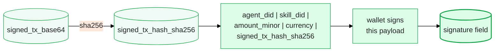

## Where this fits

`POST /api/v1/pay` is the **payment execution endpoint** — the fourth step in the payment lifecycle:

```
1. GET /api/v1/pay/require  →  "Do I need to pay?"
2. HTTP 402 response         →  "Yes, here's the payment challenge"
3. Client builds & signs tx  →  Local: SPL transfer + OWS signing
4. POST /api/v1/pay          →  "Execute this payment"   ← YOU ARE HERE
5. Client retries resource   →  Verify purchase, get access
```

You call this endpoint **after** receiving an HTTP 402 challenge and building a signed SPL transaction locally. The StablePay plugin does this automatically — you only need to understand this flow if you're building a custom client or debugging.

## Prerequisites

Before calling this endpoint, you must have:

| Prerequisite | How it's obtained |
|-------------|-------------------|
| `agent_did` | Registered via `POST /api/v1/did/register` |
| `skill_did` | Extracted from the 402 challenge response |
| `signed_tx_base64` | Built locally via Solana RPC + OWS wallet signature |
| `signature` (business) | `sha256(agent_did\|skill_did\|amount_minor\|currency\|signed_tx_hash_sha256)` signed by wallet |
| Gateway auth headers | `sha256(POST body)` canonical string, signed with timestamp+nonce |

## Authentication

This endpoint requires **DID signature authentication** via four headers:

| Header | Value |
|--------|-------|
| `X-StablePay-DID` | Your agent DID (`did:solana:...`) |
| `X-StablePay-Signature` | Base58 Ed25519 signature of the gateway canonical string |
| `X-StablePay-Timestamp` | ISO 8601 timestamp (must be within ±5 minutes of server time) |
| `X-StablePay-Nonce` | Unique random string per request (prevents replay) |

**Gateway canonical string** (what you sign):

```
POST\n/api/v1/pay\n\n{sha256(request_body)}
```

The body must be **pre-serialized JSON with a fixed key order** so the SHA256 hash is deterministic:

```json
{"agent_did":"...","skill_did":"...","amount":"1.00","currency":"USDC","signed_tx_base64":"...","signature":"...","order_id":"...","timestamp":1717000000,"nonce":"biz-..."}
```

<Info>
  The plugin handles the canonical signing automatically. If you're calling the API directly (not via the plugin), use `stablepay_sign_message` with `append_timestamp_nonce: true` to generate the gateway signature.
</Info>

## Idempotency

Pass an `X-Idempotency-Key` header to prevent duplicate payments. The Payment Service generates an idempotency key internally based on `agent_did + skill_did`, but providing your own key gives you control over retry behavior.

If you submit the same payment twice with different idempotency keys, the second call returns error `20002` (payment already exists).

## Request body fields

| Field | Type | Source |
|-------|------|--------|
| `agent_did` | string | Your registered DID |
| `skill_did` | string | From the 402 challenge (`did:solana:<developer>`) |
| `amount` | string | Decimal price from the 402 challenge (e.g., `"1.00"`) |
| `currency` | string | `"USDC"` or `"USDT"` |
| `signed_tx_base64` | string | Base64-encoded partially-signed SPL Token transfer transaction |
| `signature` | string | Business signature: `sha256(agent_did\|skill_did\|amount_minor\|currency\|signed_tx_hash)` signed by your wallet |
| `order_id` | string | Client-generated unique order identifier (format: `openclaw-{ts}-{random}`) |
| `timestamp` | integer | Unix seconds when the business signature was created |
| `nonce` | string | Unique nonce for the business signature (format: `biz-{ts}-{random}`) |

### Field relationships



## Response

```json
{
  "code": 0,
  "message": "success",
  "data": {
    "tx_id": "uuid",
    "tx_hash": "solana_tx_hash",
    "status": "pending"
  }
}
```

<Note>
  The initial response status is typically `"pending"`. Confirmation happens asynchronously — the Payment Service polls Solana (up to 60 times × 5 seconds = 5 minutes). Use `GET /api/v1/pay/{tx_id}` to check the final status.
</Note>

## Error handling

| Code | Message | Cause | Recovery |
|------|---------|-------|----------|
| `10001` | invalid parameters | Missing required field or malformed body | Check request body against the field table above |
| `10004` | signature verification failed | Gateway signature or business signature invalid | Verify canonical string format, timestamp freshness, key order in JSON |
| `20001` | insufficient balance | Agent wallet doesn't have enough USDC | User needs to deposit USDC to their wallet |
| `20002` | payment already exists | Duplicate payment for the same agent+skill pair | This is expected on retry — treat as success |
| `20003` | blockchain network error | Solana RPC unavailable or tx rejected | Retry with exponential backoff (up to 3 times) |
| `20004` | gas subsidy failed | Hotwallet couldn't cover gas fees | Report to platform operators; retry may succeed later |
| `30004` | rate limit exceeded | Too many requests from this DID | Wait and retry (DID-level limit: 50/min) |

## Example (curl)

```bash
# Step 1: Build the canonical body (key order matters!)
BODY='{"agent_did":"did:solana:AbCd...","skill_did":"did:solana:XyZ...","amount":"1.00","currency":"USDC","signed_tx_base64":"AQAAAA...","signature":"3xyz...","order_id":"openclaw-1717000000-a1b2c3","timestamp":1717000000,"nonce":"biz-1717000000-d4e5f6"}'

# Step 2: Compute SHA256 of body
BODY_HASH=$(echo -n "$BODY" | sha256sum | cut -d' ' -f1)

# Step 3: Build canonical string
CANONICAL="POST\n/api/v1/pay\n\n$BODY_HASH"

# Step 4: Sign the canonical (use stablepay_sign_message in TUI)
# SIGNATURE=$(sign_message "$CANONICAL")

# Step 5: Submit
curl -X POST "https://ai.wenfu.cn/api/v1/pay" \
  -H "Content-Type: application/json" \
  -H "X-StablePay-DID: did:solana:AbCd..." \
  -H "X-StablePay-Signature: <gateway-signature>" \
  -H "X-StablePay-Timestamp: $(date -u +%Y-%m-%dT%H:%M:%SZ)" \
  -H "X-StablePay-Nonce: gw-$(date +%s)-$(openssl rand -hex 4)" \
  -H "X-Idempotency-Key: openclaw-biz-1717000000-d4e5f6" \
  -d "$BODY"
```

## See also

- `GET /api/v1/pay/require` — the preceding step that triggers the 402 challenge
- `GET /api/v1/pay/{tx_id}` — check transaction status after submission
- `GET /api/v1/verify` — confirm purchase record exists (called by developer backends)
