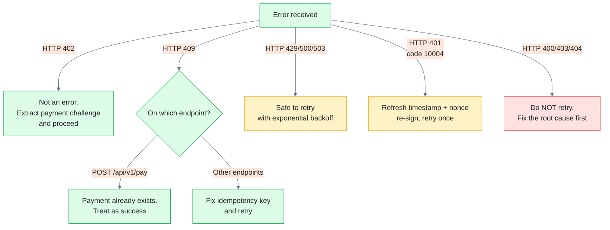
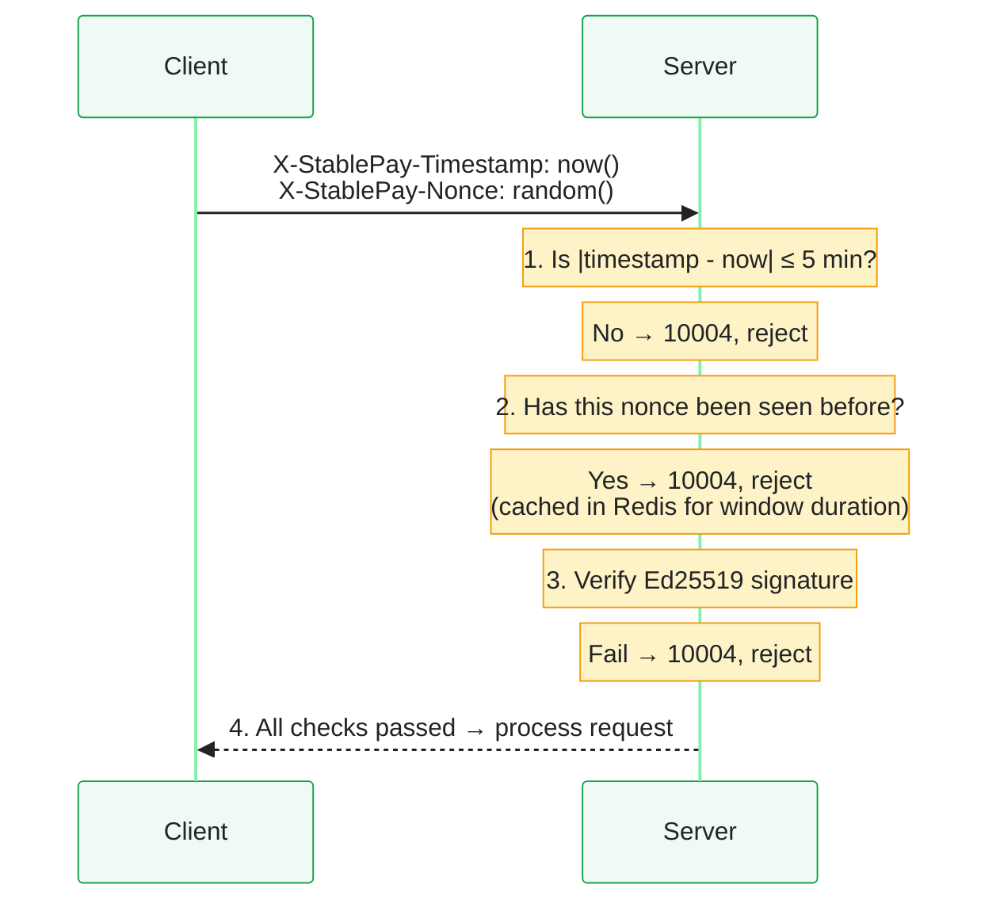

## Which errors should I retry?

Not all failures are safe to retry. Apply this decision tree:



## Retry strategy

For retry-safe errors (`429`, `500`, `503`), use **exponential backoff with jitter**:

<Tabs>
  <Tab title="TypeScript">
    ```typescript
    async function fetchWithRetry(
      url: string,
      options: RequestInit,
      maxRetries = 3
    ): Promise<Response> {
      for (let attempt = 0; attempt <= maxRetries; attempt++) {
        const res = await fetch(url, options);
        if (res.ok || res.status === 402) return res; // 402 is normal

        // Don't retry client errors
        if ([400, 403, 404].includes(res.status)) throw new ApiError(res);

        // Last attempt — give up
        if (attempt === maxRetries) throw new ApiError(res);

        // Exponential backoff with jitter: 1s → 2s → 4s
        const baseMs = 1000 * Math.pow(2, attempt);
        const jitter = Math.random() * 500;
        await sleep(baseMs + jitter);
      }
      throw new Error("unreachable");
    }
    ```
  </Tab>
  <Tab title="Python">
    ```python
    import time, random, requests

    def fetch_with_retry(url, headers=None, json=None, max_retries=3):
        for attempt in range(max_retries + 1):
            resp = requests.request(
                "GET" if json is None else "POST",
                url, headers=headers, json=json
            )
            if resp.ok or resp.status_code == 402:
                return resp  # 402 is normal business flow

            if resp.status_code in (400, 403, 404):
                raise ApiError(resp)  # Don't retry

            if attempt == max_retries:
                raise ApiError(resp)

            base_ms = 1000 * (2 ** attempt)
            jitter = random.uniform(0, 500) / 1000
            time.sleep((base_ms / 1000) + jitter)
    ```
  </Tab>
</Tabs>

### Platform retry parameters (from tech.md)

| Setting | Value |
|---------|-------|
| Internal RPC timeout | 1000ms |
| External HTTP timeout | 2000ms |
| Max retries | 3 |
| Backoff intervals | 100ms → 200ms → 400ms |
| Circuit breaker threshold | 5 consecutive failures → open for 30s |

---

## Idempotency

Idempotency is critical for payment endpoints. If a network timeout occurs after the server processed your `POST /api/v1/pay` but before you received the response, retrying without an idempotency key could result in a duplicate charge.

### X-Idempotency-Key

Pass this header on `POST /api/v1/pay`:

```
X-Idempotency-Key: openclaw-biz-1717000000-d4e5f6
```

The Payment Service generates its own idempotency key internally (`agent_did + skill_did`), but providing your own gives you control. If the same key is submitted twice:

- First call: payment is executed normally
- Second call: returns `20002` (payment already exists) — **treat this as success**

### Key construction

A good idempotency key is:
- **Unique per payment intent** — not per request
- **Deterministic on retry** — same payment intent → same key

```typescript
// One key per order, stable across retries
const orderId = `openclaw-${Date.now()}-${randomHex(8)}`;
headers["X-Idempotency-Key"] = orderId;
```

<Warning>
  Don't generate a new key on every retry. If your first attempt succeeded but timed out on the response, a new key on the retry would create a duplicate payment. Use the same key and handle `20002` as success.
</Warning>

### Idempotency key scope

| Key type | Scope | TTL |
|----------|-------|-----|
| Payment idempotency (`agent_did + skill_did`) | Per agent-skill pair | 30 minutes (Redis) |
| `X-Idempotency-Key` (client-provided) | Per key value | Duration of the payment flow |

---

## Anti-replay: timestamp + nonce

Every DID-authenticated request includes a timestamp and nonce to prevent intercepted requests from being replayed.

### How it works


```

### Nonce format

The plugin generates nonces in this format:

```
gw-{unix_ms}-{random_hex_8}
```

Example: `gw-1717000000000-a1b2c3d4`

Each nonce must be globally unique. The server caches processed nonces for the duration of the timestamp window (±5 minutes). After the window closes, nonces are evicted.

### Timestamp format

ISO 8601, UTC:

```
2026-05-30T10:30:00Z
```

Must be within ±5 minutes of server time. If your clock drifts, refresh and re-sign.

### Building the canonical string

The timestamp and nonce are **appended to the canonical string** before signing:

```
{method}\n{path}\n{rawQuery}\n{bodySha256Hex}{timestamp}{nonce}
```

For example, a GET request:

```
GET\n/api/v1/balance\nagent_did=did%3Asolana%3AAbCd\ne3b0c4...2026-05-30T10:30:00Zgw-1717000000000-a1b2c3d4
```

<Info>
  The plugin does this automatically via `stablepay_sign_message` with `append_timestamp_nonce: true`. You only need to construct the canonical manually if you're calling the API from your own code (not via the plugin).
</Info>

---

## When idempotency and replay protection overlap

| Concern | Mechanism | What it prevents |
|---------|-----------|-----------------|
| Duplicate payment on retry | `X-Idempotency-Key` | Double-charging when a payment response is lost in transit |
| Stolen request replay | Timestamp + nonce | An attacker capturing and re-sending your signed request |
| Signature forgery | Ed25519 verification | An attacker forging a request without your private key |

All three are required. None replaces the others.

---

## See also

- [Error codes reference](/api-reference/errors/error-codes) — which HTTP statuses and error codes map to which recovery action
- [Authentication](/api-reference/introduction#authentication) — how DID signatures and canonical strings work
- [Submit Payment endpoint](/api-reference/endpoint/pay-submit) — where `X-Idempotency-Key` is used in practice
