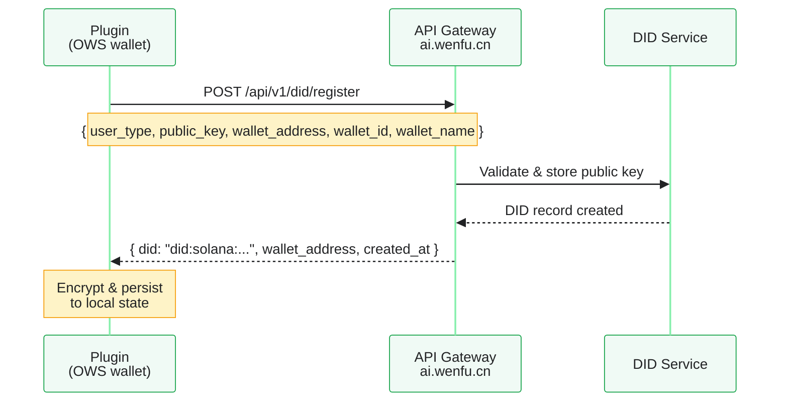

<Note>
  **One-time setup.** You register your DID once after creating your wallet. The same DID works as your `skill_did` for all the skills you publish.
</Note>

## What is a DID?

A DID (Decentralized Identifier) in StablePay follows the W3C `did:solana` method:

```
did:solana:<base58-encoded-ed25519-public-key>
```

It serves three purposes simultaneously:
1. **Identity** — your unique identifier in the StablePay ecosystem
2. **Wallet address** — the Solana address that receives payments
3. **Skill identifier** — for developers, this IS your `skill_did`

## Registration flow



## Register in TUI

### Prerequisite

You must have a wallet first. Run `stablepay_runtime_status` and confirm `has_wallet: true`. If not, create or bind a wallet before proceeding.

### For Agent users (buyers)

> Run stablepay_register_local_did with user_type "agent"

### For Developers (sellers)

> Run stablepay_register_local_did with user_type "developer"

<Info>
  The `user_type` distinction is informational. There is no functional difference in the registration API — both result in the same DID record. Choosing `developer` helps the system categorize your identity for future platform features.
</Info>

## Registration paths

The plugin supports two registration API paths:

| Path | When used | Server behavior |
|------|-----------|-----------------|
| `POST /api/v1/did/register` | Default — client-held wallet | Server stores only the public key; private key stays with you |
| `POST /api/v1/did` | Server-side key generation (legacy) | Server generates and stores the key pair |

The default `didRegisterPath` is `/api/v1/did/register`, which is the correct choice for the client-held wallet model. This is the path used in all examples.

<Warning>
  Do not use `POST /api/v1/did` (server-side key generation) unless you have a specific reason. It creates keys on the server, which contradicts the "you hold your own keys" model.
</Warning>

## After registration

The plugin stores the `backendDid` in your encrypted local state. Subsequent operations (payment, balance query, sales query) will use this DID for authentication.

To verify:

> Run stablepay_runtime_status

Output should now show:
```
has_wallet: true
wallet.backend_did: did:solana:AbCdEf...
```

## Next steps

<CardGroup cols={2}>
  <Card title="Set payment limits" icon="sliders" href="/quickstart#step-54-set-payment-limits">
    Configure single purchase and auto-purchase limits.
  </Card>
  <Card title="Integrate payments" icon="credit-card" href="/integrating-payment">
    Add x402 payment to your skill.
  </Card>
</CardGroup>
