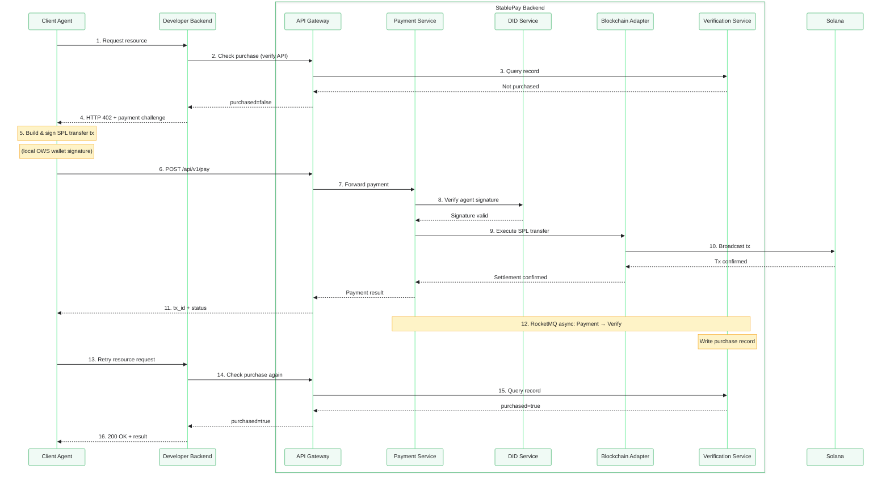

## What is StablePay?

StablePay is a decentralized payment infrastructure for the AI Agent economy. It lets your Agent **discover, purchase, and pay for services** — all through natural conversation, settled instantly on Solana.

Built on open standards:
- **W3C `did:solana`** — decentralized identity; your wallet is your identity
- **x402 / HTTP 402** — the payment protocol for the machine economy
- **A2A Protocol** — Agent-to-Agent service discovery and negotiation

<Card
  title="Get started in 5 minutes"
  icon="rocket"
  href="/quickstart"
  horizontal
>
  Install the plugin, create a wallet, register your DID, and make your first payment.
</Card>

## Who is this for?

<Columns cols={2}>
  <Card
    title="I'm a Service Developer"
    icon="hammer"
    href="/wallet-setup"
  >
    Create a wallet, register a developer DID, integrate x402 payments into your skill, publish on MoltBay, and earn revenue.
  </Card>
  <Card
    title="I'm an Agent User"
    icon="user"
    href="/quickstart"
  >
    Set up your wallet, configure spending limits, and let your Agent discover and purchase services automatically.
  </Card>
</Columns>

## Architecture

## Core concepts

<Columns cols={2}>
  <Card
    title="DID = Identity + Wallet"
    icon="fingerprint"
    href="/wallet-setup"
  >
    Your `did:solana:<pubkey>` is both your decentralized identity and your Solana wallet address. No separate accounts needed.
  </Card>
  <Card
    title="skill_did = Payee"
    icon="arrow-right-arrow-left"
    href="/integrating-payment"
  >
    For developers: your DID is your `skill_did`. Payments go directly to your wallet — instant settlement, no intermediaries.
  </Card>
  <Card
    title="OWS Signing"
    icon="key"
    href="/development"
  >
    Private keys stay on your machine. The plugin uses OWS (Open Wallet Standard) to sign transactions locally. Multiple runtime options: SDK, CLI, or REST.
  </Card>
  <Card
    title="Fee Payer Model"
    icon="coins"
    href="/development#fee-payer"
  >
    Users pay only for the service (USDC). Gas fees (SOL) are covered by the platform hotwallet. No need to hold SOL.
  </Card>
</Columns>

## Ready to start?

<CardGroup cols={2}>
  <Card title="Quickstart" icon="rocket" href="/quickstart">
    Install, configure, and pay in under 5 minutes.
  </Card>
  <Card title="Wallet & DID" icon="wallet" href="/wallet-setup">
    Deep dive into wallet creation and DID management.
  </Card>
  <Card title="x402 Integration" icon="credit-card" href="/integrating-payment">
    Add payment to your skill with HTTP 402.
  </Card>
  <Card title="API Reference" icon="code" href="/api-reference/introduction">
    Full REST API documentation.
  </Card>
</CardGroup>
