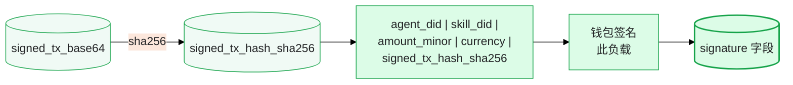

## 在流程中的位置

`POST /api/v1/pay` 是**支付执行端点**——支付生命周期的第���步：

```
1. GET /api/v1/pay/require  →  "需要支付吗？"
2. HTTP 402 响应             →  "是的，以下是支付挑战"
3. 客户端构建并签名交易       →  本地：SPL 转账 + OWS 签名
4. POST /api/v1/pay          →  "执行此支付"   ← 当前位置
5. 客户端重试资源请求         →  验证购买，获取访问权限
```

在收到 HTTP 402 挑战并在本地构建签名 SPL 交易后调用此端点。StablePay 插件自动完成这一切——只有在你构建自定义客户端或调试时才需要理解此流程。

## 前置条件

调用此端点前，必须具备：

| 前置条件 | 获取方式 |
|-------------|-------------------|
| `agent_did` | 通过 `POST /api/v1/did/register` 注册 |
| `skill_did` | 从 402 挑战响应中提取 |
| `signed_tx_base64` | 通过 Solana RPC + OWS 钱包签名在本地构建 |
| `signature`（业务签名） | `sha256(agent_did\|skill_did\|amount_minor\|currency\|signed_tx_hash_sha256)` 由钱包签名 |
| 网关认证头 | `sha256(POST body)` 规范字符串签名，附带 timestamp+nonce |

## 认证

此端点需要**四个请求头**的 **DID 签名认证**：

| 请求头 | 值 |
|--------|-------|
| `X-StablePay-DID` | 你的 Agent DID（`did:solana:...`） |
| `X-StablePay-Signature` | 网关规范字符串的 Base58 Ed25519 签名 |
| `X-StablePay-Timestamp` | ISO 8601 时间戳（必须在服务器时间 ±5 分钟内） |
| `X-StablePay-Nonce` | 每请求唯一的随机字符串（防重放） |

**网关规范字符串**（你需要签名的内容）：

```
POST\n/api/v1/pay\n\n{sha256(request_body)}
```

body 必须**预序列化 JSON 且键顺序固定**，使 SHA256 哈希具有确定性：

```json
{"agent_did":"...","skill_did":"...","amount":"1.00","currency":"USDC","signed_tx_base64":"...","signature":"...","order_id":"...","timestamp":1717000000,"nonce":"biz-..."}
```

<Info>
  插件自动处理规范签名。如果你直接调用 API（而非通过插件），使用 `stablepay_sign_message` 并设置 `append_timestamp_nonce: true` 来生成网关签名。
</Info>

## 幂等性

传入 `X-Idempotency-Key` 请求头以防止重复支付。Payment Service 内部基于 `agent_did + skill_did` 生成幂等键，但提供自己的键可以让你控制重试行为。

如果使用不同的幂等键提交相同的支付两次，第二次调用返回错误 `20002`（支付已存在）。

## 请求体字段

| 字段 | 类型 | 来源 |
|-------|------|--------|
| `agent_did` | string | 你已注册的 DID |
| `skill_did` | string | 来自 402 挑战（`did:solana:<developer>`） |
| `amount` | string | 来自 402 挑战的十进制价格（如 `"1.00"`） |
| `currency` | string | `"USDC"` 或 `"USDT"` |
| `signed_tx_base64` | string | Base64 编码的部分签名 SPL Token 转账交易 |
| `signature` | string | 业务签名：`sha256(agent_did\|skill_did\|amount_minor\|currency\|signed_tx_hash)` 由钱包签名 |
| `order_id` | string | 客户端生成的唯一订单标识符（格式：`openclaw-{ts}-{random}`） |
| `timestamp` | integer | 创建业务签名时的 Unix 秒数 |
| `nonce` | string | 业务签名的唯一 nonce（格式：`biz-{ts}-{random}`） |

### 字段关系



## 响应

```json
{
  "code": 0,
  "message": "success",
  "data": {
    "tx_id": "uuid",
    "tx_hash": "solana_tx_hash",
    "status": "pending"
  }
}
```

<Note>
  初始响应状态通常为 `"pending"`。确认是异步的——Payment Service 轮询 Solana（最多 60 次 × 5 秒 = 5 分钟）。使用 `GET /api/v1/pay/{tx_id}` 检查最终状态。
</Note>

## 错误处理

| 错误码 | 消息 | 原因 | 恢复方式 |
|------|---------|-------|----------|
| `10001` | invalid parameters | 缺少必需字段或 body 格式错误 | 对照上面的字段表检查请求体 |
| `10004` | signature verification failed | 网关签名或业务签名无效 | 验证规范字符串格式、时间戳新鲜度、JSON 键顺序 |
| `20001` | insufficient balance | Agent 钱包 USDC 余额不足 | 用户需要向其钱包存入 USDC |
| `20002` | payment already exists | 同一 agent+skill 对的重复支付 | 重试时这是预期行为——视为成功 |
| `20003` | blockchain network error | Solana RPC 不可用或交易被拒 | 使用指数退避重试（最多 3 次） |
| `20004` | gas subsidy failed | 热钱包无法覆盖 Gas 费 | 向平台运营者报告；重试可能稍后成功 |
| `30004` | rate limit exceeded | 此 DID 的请求过多 | 等待并重试（DID 级限制：50/分钟） |

## 示例（curl）

```bash
# 步骤 1：构建规范 body（键顺序很重要！）
BODY='{"agent_did":"did:solana:AbCd...","skill_did":"did:solana:XyZ...","amount":"1.00","currency":"USDC","signed_tx_base64":"AQAAAA...","signature":"3xyz...","order_id":"openclaw-1717000000-a1b2c3","timestamp":1717000000,"nonce":"biz-1717000000-d4e5f6"}'

# 步骤 2：计算 body 的 SHA256
BODY_HASH=$(echo -n "$BODY" | sha256sum | cut -d' ' -f1)

# 步骤 3：构建规范字符串
CANONICAL="POST\n/api/v1/pay\n\n$BODY_HASH"

# 步骤 4：签名规范字符串（在 TUI 中使用 stablepay_sign_message）
# SIGNATURE=$(sign_message "$CANONICAL")

# 步骤 5：提交
curl -X POST "https://ai.wenfu.cn/api/v1/pay" \
  -H "Content-Type: application/json" \
  -H "X-StablePay-DID: did:solana:AbCd..." \
  -H "X-StablePay-Signature: <gateway-signature>" \
  -H "X-StablePay-Timestamp: $(date -u +%Y-%m-%dT%H:%M:%SZ)" \
  -H "X-StablePay-Nonce: gw-$(date +%s)-$(openssl rand -hex 4)" \
  -H "X-Idempotency-Key: openclaw-biz-1717000000-d4e5f6" \
  -d "$BODY"
```

## 参见

- `GET /api/v1/pay/require` — 前置步骤，触发 402 挑战
- `GET /api/v1/pay/{tx_id}` — 提交后检查交易状态
- `GET /api/v1/verify` — 确认购买记录存在（由开发者后端调用）
