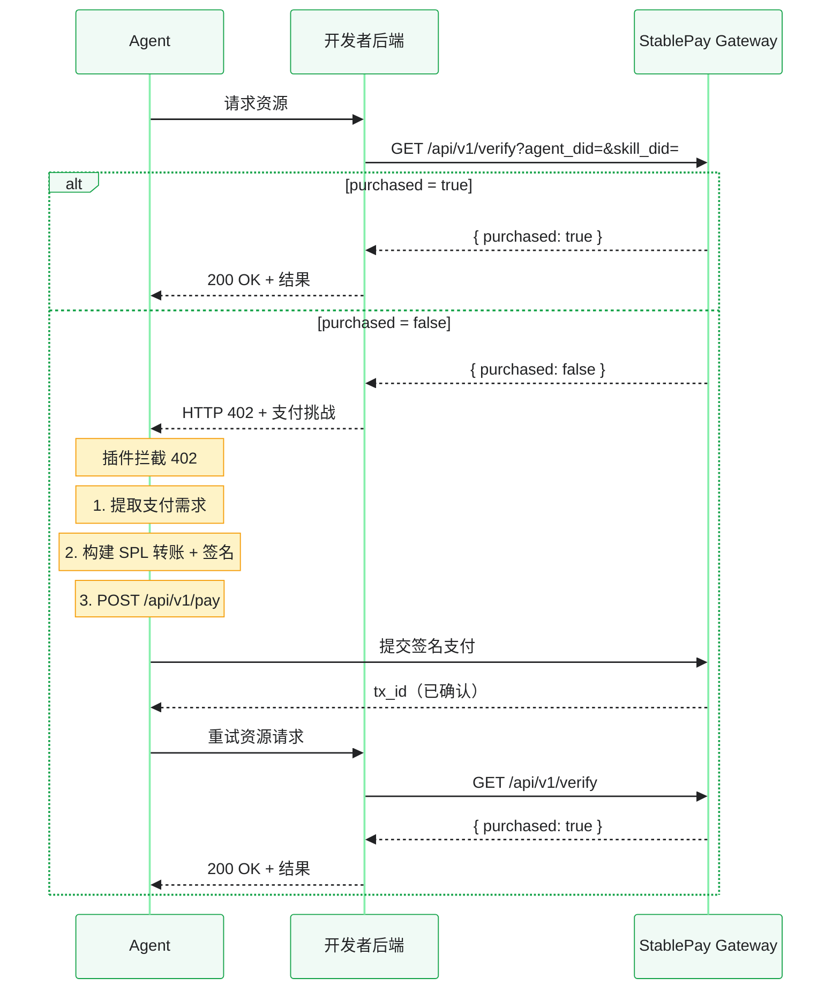

## 为什么后端验证很重要

[skill.md 支付代码块](/integrating-payment#approach-1-skillmd-payment-block)设置快速，但有一个弱点：用户可以编辑 `skill.md` 删除支付代码块，从而免费使用你的服务。

**后端验证堵住了这个漏洞。** 你的服务器每次请求都会对照 StablePay 的购买记录进行检查。如果调用者未支付，你的服务器返回 HTTP 402——StablePay 插件自动拦截、处理支付并重试。用户无法绕过，因为检查在你的服务器上进行，而非他们可以编辑的 skill 文件。

<Info>
  这与保护 Web 付费 API 的机制相同。这就是为什么 Stripe 等平台不只是在你结账页面上放一个"请付款"的横幅——它们在服务端进行验证。
</Info>

## 工作原理

你的后端每次请求只需**一次 API 调用**检查购买状态：



两次调用你的端点，一次调用 StablePay。支付在两者之间透明地发生。

## 实现

所有语言的逻辑相同：

1. 从请求中提取 `agent_did`
2. 调用 `GET /api/v1/verify?agent_did=...&skill_did=...`
3. 如果 `purchased: true` → 提供资源
4. 如果 `purchased: false` → 返回 HTTP 402 及 x402 支付挑战

<Tabs>
  <Tab title="Node.js / Express">
    ```javascript
    const express = require("express");
    const app = express();

    const STABLEPAY_GATEWAY = "https://ai.wenfu.cn";
    const MY_SKILL_DID = "did:solana:AbCdEf..."; // 你的开发者 DID
    const PRICE_USDC = "1.00";

    async function checkPurchase(agentDid, skillDid) {
      const url = `${STABLEPAY_GATEWAY}/api/v1/verify?agent_did=${encodeURIComponent(agentDid)}&skill_did=${encodeURIComponent(skillDid)}`;
      const res = await fetch(url, {
        headers: { "X-API-Key": process.env.STABLEPAY_API_KEY }
      });
      const body = await res.json();
      return body.data?.purchased === true;
    }

    function buildPaymentChallenge(skillDid, amount) {
      const amountMinor = String(Math.round(parseFloat(amount) * 1_000_000));
      return {
        x402Version: 1,
        accepts: [{
          scheme: "exact",
          network: "solana:5eykt4UsFv8P8NJdTREpY1vzqKqZKvdp",
          payTo: skillDid,
          asset: "USDC:4zMMC9srt5Ri5X14GAgXhaHii3GnPAEERYPJgZJDncDU",
          maxAmountRequired: amountMinor,
          maxTimeoutSeconds: 60,
          description: `支付 ${amount} USDC 以访问此技能`,
          extra: {
            skillDid,
            currency: "USDC",
            facilitatorUrl: `${STABLEPAY_GATEWAY}/api/v1/pay`
          }
        }]
      };
    }

    app.get("/execute", async (req, res) => {
      const agentDid = req.query.agent_did;
      if (!agentDid) {
        return res.status(400).json({ error: "agent_did is required" });
      }

      const purchased = await checkPurchase(agentDid, MY_SKILL_DID);
      if (!purchased) {
        return res.status(402).json(buildPaymentChallenge(MY_SKILL_DID, PRICE_USDC));
      }

      res.json({ result: "Skill executed successfully", agent_did: agentDid });
    });

    app.listen(8787, () => console.log("Skill backend listening on :8787"));
    ```
  </Tab>
  <Tab title="Go / Hertz">
    ```go
    package main

    import (
        "context"
        "encoding/json"
        "fmt"
        "net/http"
        "net/url"
        "os"
        "strconv"

        "github.com/cloudwego/hertz/pkg/app"
        "github.com/cloudwego/hertz/pkg/app/server"
    )

    const gatewayBase = "https://ai.wenfu.cn"
    const mySkillDID = "did:solana:AbCdEf..."
    const priceUSDC = "1.00"

    type VerifyResponse struct {
        Code int `json:"code"`
        Data struct {
            Purchased bool `json:"purchased"`
        } `json:"data"`
    }

    func checkPurchase(ctx context.Context, agentDID, skillDID string) (bool, error) {
        u := fmt.Sprintf("%s/api/v1/verify?agent_did=%s&skill_did=%s",
            gatewayBase, url.QueryEscape(agentDID), url.QueryEscape(skillDID))

        req, _ := http.NewRequestWithContext(ctx, "GET", u, nil)
        req.Header.Set("X-API-Key", os.Getenv("STABLEPAY_API_KEY"))

        resp, err := http.DefaultClient.Do(req)
        if err != nil {
            return false, err
        }
        defer resp.Body.Close()

        var v VerifyResponse
        json.NewDecoder(resp.Body).Decode(&v)
        return v.Data.Purchased, nil
    }

    func buildPaymentChallenge(skillDID, amount string) map[string]interface{} {
        f, _ := strconv.ParseFloat(amount, 64)
        amountMinor := strconv.Itoa(int(f * 1_000_000))
        return map[string]interface{}{
            "x402Version": 1,
            "accepts": []map[string]interface{}{{
                "scheme":            "exact",
                "network":           "solana:5eykt4UsFv8P8NJdTREpY1vzqKqZKvdp",
                "payTo":             skillDID,
                "asset":             "USDC:4zMMC9srt5Ri5X14GAgXhaHii3GnPAEERYPJgZJDncDU",
                "maxAmountRequired": amountMinor,
                "maxTimeoutSeconds": 60,
                "description":       fmt.Sprintf("支付 %s USDC 以访问此技能", amount),
                "extra": map[string]string{
                    "skillDid":       skillDID,
                    "currency":       "USDC",
                    "facilitatorUrl": gatewayBase + "/api/v1/pay",
                },
            }},
        }
    }

    func handleExecute(c context.Context, ctx *app.RequestContext) {
        agentDID := ctx.Query("agent_did")
        if agentDID == "" {
            ctx.JSON(400, map[string]string{"error": "agent_did is required"})
            return
        }

        purchased, err := checkPurchase(c, agentDID, mySkillDID)
        if err != nil {
            ctx.JSON(500, map[string]string{"error": "verification failed"})
            return
        }

        if !purchased {
            ctx.JSON(402, buildPaymentChallenge(mySkillDID, priceUSDC))
            return
        }

        ctx.JSON(200, map[string]interface{}{
            "result":    "Skill executed successfully",
            "agent_did": agentDID,
        })
    }

    func main() {
        h := server.Default()
        h.GET("/execute", handleExecute)
        h.Spin()
    }
    ```
  </Tab>
  <Tab title="Python / FastAPI">
    ```python
    import os
    from fastapi import FastAPI, Query, HTTPException
    from fastapi.responses import JSONResponse
    import httpx

    GATEWAY = "https://ai.wenfu.cn"
    MY_SKILL_DID = "did:solana:AbCdEf..."
    PRICE_USDC = "1.00"

    app = FastAPI()

    async def check_purchase(agent_did: str, skill_did: str) -> bool:
        url = f"{GATEWAY}/api/v1/verify"
        params = {"agent_did": agent_did, "skill_did": skill_did}
        headers = {"X-API-Key": os.getenv("STABLEPAY_API_KEY")}

        async with httpx.AsyncClient(timeout=5.0) as client:
            resp = await client.get(url, params=params, headers=headers)
            data = resp.json()
            return data.get("data", {}).get("purchased", False)

    def build_payment_challenge(skill_did: str, amount: str) -> dict:
        amount_minor = str(int(float(amount) * 1_000_000))
        return {
            "x402Version": 1,
            "accepts": [{
                "scheme": "exact",
                "network": "solana:5eykt4UsFv8P8NJdTREpY1vzqKqZKvdp",
                "payTo": skill_did,
                "asset": "USDC:4zMMC9srt5Ri5X14GAgXhaHii3GnPAEERYPJgZJDncDU",
                "maxAmountRequired": amount_minor,
                "maxTimeoutSeconds": 60,
                "description": f"支付 {amount} USDC 以访问此技能",
                "extra": {
                    "skillDid": skill_did,
                    "currency": "USDC",
                    "facilitatorUrl": f"{GATEWAY}/api/v1/pay"
                }
            }]
        }

    @app.get("/execute")
    async def execute(agent_did: str = Query(..., description="Agent DID")):
        purchased = await check_purchase(agent_did, MY_SKILL_DID)

        if not purchased:
            return JSONResponse(
                status_code=402,
                content=build_payment_challenge(MY_SKILL_DID, PRICE_USDC)
            )

        return {"result": "Skill executed successfully", "agent_did": agent_did}
    ```
  </Tab>
  <Tab title="curl (手动测试)">
    ```bash
    # 步骤 1：检查购买状态
    curl -H "X-API-Key: $STABLEPAY_API_KEY" \
      "https://ai.wenfu.cn/api/v1/verify?agent_did=did:solana:<buyer>&skill_did=did:solana:<yours>"

    # 未购买时的响应：
    # { "code": 0, "data": { "purchased": false } }

    # 步骤 2：你的服务器应返回 HTTP 402：
    # HTTP/1.1 402 Payment Required
    # {
    #   "x402Version": 1,
    #   "accepts": [{ "maxAmountRequired": "1000000", ... }]
    # }

    # 步骤 3：Agent 的插件处理支付 → 重试 → 现在 purchased: true
    curl -H "X-API-Key: $STABLEPAY_API_KEY" \
      "https://ai.wenfu.cn/api/v1/verify?agent_did=did:solana:<buyer>&skill_did=did:solana:<yours>"

    # 支付后的响应：
    # { "code": 0, "data": { "purchased": true, "purchase_time": "..." } }
    ```
  </Tab>
</Tabs>

## 关键模式

### 每次请求都要检查

不要缓存购买状态。每次都要检查。`/api/v1/verify` 调用耗时不到 500ms，且免费。将 `purchased = true` 的用户缓存为性能优化是可以的，但永远不要完全跳过检查。

### 服务端到服务端调用使用 API Key 认证

你的后端调用 StablePay，而非用户的 Agent。使用 `X-API-Key` 认证——比 DID 签名更简单，且不需要服务器上的钱包访问权限。联系 StablePay 团队获取。

### 返回正确的 x402 挑战

插件的 `extractPaymentRequirement()` 自动解析 402 响应。如果你的挑战格式有误（缺少 `skillDid`、`maxAmountRequired` 类型错误），插件将抛出错误而非处理支付。对照 [x402 格式参考](/x402-format) 测试你的 402 响应体。

### 处理异步购买记录延迟

购买记录通过 RocketMQ 异步写入。`POST /api/v1/pay` 成功后，购买记录最多可能需要 5 秒（边缘情况：30 秒）才出现在 Verification Service 中。插件自动重试最多 6 次，间隔 1.5 秒。如果你构建自定义客户端，请添加类似的重试逻辑。

## 测试集成

1. 用以上代码启动你的后端
2. 在 OpenClaw TUI 中，确保 Agent 钱包已设置并有 USDC
3. 告诉你的 Agent："Access my skill at http://127.0.0.1:8787/execute"
4. 第一个请求应收到 402——插件将自动处理支付
5. 支付后（链确认 + 购买记录），重试应收到 200

也可以手动测试：

```bash
# 模拟未支付的 Agent
curl "http://127.0.0.1:8787/execute?agent_did=did:solana:unpaid-agent"

# 预期：HTTP 402，body 中包含 x402 挑战
```

## 参见

<CardGroup cols={2}>
  <Card title="集成 x402 支付" icon="credit-card" href="/integrating-payment">
    两种集成方式概览（skill.md vs 后端）。
  </Card>
  <Card title="x402 格式参考" icon="file-code" href="/x402-format">
    支付挑战响应格式的完整规范。
  </Card>
  <Card title="验证购买端点" icon="circle-check" href="/api-reference/endpoint/verify-purchase">
    GET /api/v1/verify 的 API 参考。
  </Card>
  <Card title="错误码" icon="circle-exclamation" href="/api-reference/errors/error-codes">
    各 HTTP 状态码和错误码的含义。
  </Card>
</CardGroup>
