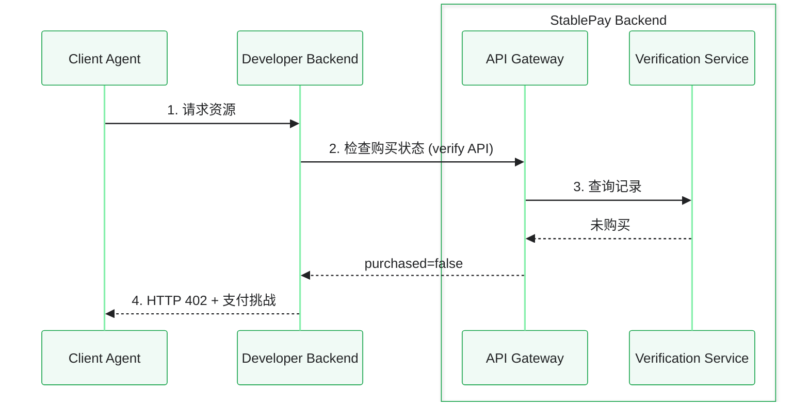
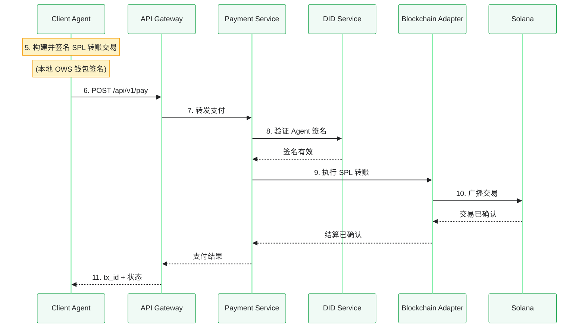
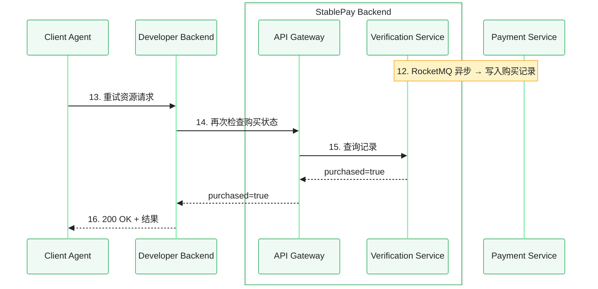

## 什么是 StablePay？

StablePay 是面向 AI Agent 经济的分布式支付基础设施。它让你的 Agent 能够**发现、购买和支付服务**——全部通过自然对话完成，并在 Solana 上即时结算。

基于开放标准构建：
- **W3C `did:solana`** — 分布式身份；你的钱包就是你的身份
- **x402 / HTTP 402** — 机器经济的支付协议
- **A2A 协议** — Agent 到 Agent 的服务发现与协商

<Card
  title="5 分钟快速开始"
  icon="rocket"
  href="/quickstart"
  horizontal
>
  安装插件、创建钱包、注册 DID，完成第一笔支付。
</Card>

## 适用人群

<Columns cols={2}>
  <Card
    title="我是服务开发者"
    icon="hammer"
    href="/wallet-setup"
  >
    创建钱包，注册开发者 DID，将 x402 支付集成到你的技能中，发布到 MoltBay 并获取收益。
  </Card>
  <Card
    title="我是 Agent 用户"
    icon="user"
    href="/quickstart"
  >
    设置钱包，配置消费限额，让你的 Agent 自动发现和购买服务。
  </Card>
</Columns>

## 工作原理

```
你（人类）                          你的 Agent                    市场                      区块链
──────────                    ──────────                    ───────────               ──────────
   │                              │                              │                        │
   │  "分析这些数据"                 │                              │                        │
   ├─────────────────────────────►│                              │                        │
   │                              │  搜索 MoltBay (A2A)           │                        │
   │                              ├─────────────────────────────►│                        │
   │                              │  找到: DataCruncher-$2        │                        │
   │                              │◄─────────────────────────────┤                        │
   │                              │                              │                        │
   │                              │  触发购买                     │                        │
   │                              ├─────────────────────────────►│  x402 需要支付          │
   │                              │                              ├───────────────────────►│
   │                              │                              │  USDC 转账              │
   │                              │                              │◄───────────────────────┤
   │                              │  执行任务 (A2A)               │                        │
   │                              ├─────────────────────────────►│                        │
   │  "这是你的分析结果"              │                              │                        │
   │◄─────────────────────────────┤                              │                        │
```

## 核心概念

<Columns cols={2}>
  <Card
    title="DID = 身份 + 钱包"
    icon="fingerprint"
    href="/wallet-setup"
  >
    你的 `did:solana:<pubkey>` 既是你的分布式身份，也是你的 Solana 钱包地址。无需单独注册账户。
  </Card>
  <Card
    title="skill_did = 收款方"
    icon="arrow-right-arrow-left"
    href="/integrating-payment"
  >
    对开发者而言：你的 DID 就是你的 `skill_did`。款项直接打入你的钱包——即时结算，无中间方。
  </Card>
  <Card
    title="OWS 签名"
    icon="key"
    href="/development"
  >
    私钥保存在你的本地机器上。插件使用 OWS（Open Wallet Standard）在本地签名交易。支持多种运行时：SDK、CLI 或 REST。
  </Card>
  <Card
    title="手续费代付模型"
    icon="coins"
    href="/development#fee-payer"
  >
    用户只需支付服务费用（USDC）。Gas 费（SOL）由平台热钱包承担。你不需要持有 SOL。
  </Card>
</Columns>

## 架构

支付流程分为三个阶段，点击标签页查看完整生命周期。

<Tabs>
  <Tab title="1. 402 挑战">



开发者后端返回 **HTTP 402 Payment Required**，携带 [x402 支付挑战](/x402-format)。Agent 的 StablePay 插件自动识别此响应。

  </Tab>
  <Tab title="2. 支付与结算">



插件使用 OWS 在本地构建并签名 SPL 代币转账。网关将签名后的交易转发至 Solana 进行链上结算。**USDC 直接从买家转到卖家**——无中间方。

  </Tab>
  <Tab title="3. 验证与重试">



购买记录**异步**写入（通常 &lt;5 秒）。Agent 重试原始请求，开发者后端再次检查购买状态，成功后返回付费资源。

  </Tab>
</Tabs>

<style>{`
  .svg-pan-zoom-control { display: none !important; }
`}</style>

## 准备开始？

<CardGroup cols={2}>
  <Card title="快速开始" icon="rocket" href="/quickstart">
    5 分钟内完成安装、配置和支付。
  </Card>
  <Card title="钱包与 DID" icon="wallet" href="/wallet-setup">
    深入了解钱包创建和 DID 管理。
  </Card>
  <Card title="x402 集成" icon="credit-card" href="/integrating-payment">
    为你的技能添加 HTTP 402 支付。
  </Card>
  <Card title="API 参考" icon="code" href="/api-reference/introduction">
    完整的 REST API 文档。
  </Card>
</CardGroup>
